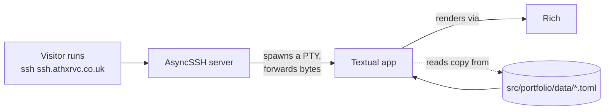

# portfolio-terminal

> An SSH-accessible terminal portfolio. Connect over SSH and you land inside
> an interactive Textual TUI — no browser, no account, no shell.

```bash
ssh ssh.athxrvc.co.uk
```

That's the entire pitch: drop a stranger into a tiny sandboxed terminal product
and walk them around.

---

## Why this exists

Most portfolios are websites, and I can't make good websites. This one is a
terminal product experience:

- **Connect** over SSH
- **Land** on a gradient wordmark, a typed tagline and a `whoami` card
- **Navigate** with tabs, arrow keys, number keys or the mouse
- **Never** get a real shell, command execution, or file transfer

It's hosted on a tiny VPS and replies to anyone.

---

## Features

- 🌐 **SSH-native.** Any client works — `ssh`, Termius, Blink, PuTTY.
- ⌨️ **Keyboard *and* mouse.** Tabs, `1`–`6` to jump, ↑ / ↓ (or `j` / `k`) to select, Enter to open, `c` to copy, Esc for home, `q` to quit. Click tabs and rows too.
- 🎨 **Modern, minimal.** Prompt-style header, live London clock, master-detail panes, tag chips, and a shimmering gradient wordmark above a typed-out tagline.
- 📱 **Responsive.** Reflows down to ~60 columns: compact wordmark, stacked panes, and footer hints that drop by priority.
- 🔒 **Sandboxed.** Anonymous auth, no shell channel, no SFTP, no exec, no command palette. Every visitor gets a fresh isolated TUI in their own PTY.
- 📝 **Content as data.** All copy lives in TOML files under `src/portfolio/data/`. Adding a section is a new file plus one menu entry.
- 🪶 **Lightweight.** Single Python process, no database, no frontend build.

---

## Quick start

### Requirements

- Python **3.11+**
- [`uv`](https://docs.astral.sh/uv/) for deps and script entrypoints

### Run the TUI directly (fastest feedback loop)

Great for iterating on screens, content, or themes without an SSH server in
the way:

```bash
uv sync
uv run portfolio-tui
```

This runs the Textual app in your current terminal.

### Run the SSH server locally

```bash
uv sync
uv run portfolio-ssh
ssh -p 2222 127.0.0.1
```

The first run auto-generates an Ed25519 host key at `keys/ssh_host_key`
(ignored by git). Local mode binds to `127.0.0.1:2222` by default — override
with the `PORTFOLIO_HOST` / `PORTFOLIO_PORT` env vars (see
[Configuration](#configuration)).

---

## How it works

Each SSH connection maps to its own pseudo-terminal running the Textual TUI.
The server doesn't expose a shell — it only knows how to spawn the portfolio
process inside a PTY and pipe bytes back and forth.



Key design points:

- **Anonymous SSH.** `PortfolioSSHServer.begin_auth` returns `False`, so no
  credentials are required. Password and public-key auth are explicitly
  disabled.
- **PTY-per-session.** Every visitor gets an isolated pseudo-terminal running
  the TUI. `SIGWINCH` from terminal resizes is forwarded into the PTY so the
  layout reflows live.
- **No shell, no exec.** The server registers only a `process_factory` —
  no SFTP subsystem, no shell channel, no command execution. Visitors can
  only run the portfolio.
- **Raw bytes, no encoding.** Bytes pass between the SSH channel and the
  PTY unchanged (`encoding=None` on the AsyncSSH server), so Rich/Textual
  terminal escape sequences round-trip cleanly.
- **Links go to the visitor.** The server sets `PORTFOLIO_REMOTE=1` for the
  TUI, so Enter on a link copies it to the visitor's clipboard over OSC 52
  rather than launching a browser on the VPS. (Run locally and it opens your
  browser instead.)
- **Content as data.** All copy lives in TOML under `src/portfolio/data/`.
  Adding a new section is a new file plus one menu entry — no code changes.

---

## Tech stack

| Layer | Tool | Why |
|-------|------|-----|
| Language | Python 3.11+ | Single runtime for server **and** UI |
| SSH server | [AsyncSSH](https://asyncssh.readthedocs.io/) | Async Pythonic SSH with PTY + `process_factory` |
| Terminal UI | [Textual](https://textual.textualize.io/) | Screen-based TUI, reactive state, stylesheets |
| Rendering | [Rich](https://rich.readthedocs.io/) | Styled text, OSC 8 hyperlinks, OSC 52 clipboard |
| Content format | TOML | Human-editable, diffable, living in version control |
| Tooling | [uv](https://docs.astral.sh/uv/) | Dependency management and console scripts |

---

## Project layout

```text
src/portfolio/
  __init__.py            package marker + version
  __main__.py            `python -m portfolio`  → starts the SSH server
  server.py              AsyncSSH server, host-key generation, PTY bridge
  app.py                 Textual App root; registers the theme, pushes Shell
  tui.py                 `portfolio-tui`  → runs the TUI in this terminal
  shell.py               Persistent frame: prompt, tab bar, clock, footer hints, keys
  content.py             TOML loader, dataclasses, in-memory cache
  theme.py               Palette constants, Textual theme, tag-chip renderable
  theme.tcss             Textual stylesheet
  art/
    name.txt             Wide ASCII wordmark (gradient + shimmer are drawn in code)
    name_compact.txt     Wordmark used on narrow / short terminals
  views/
    home.py              Wordmark, typed tagline, "whoami" card
    listing.py           Master-detail list (experience, projects, about)
    skills.py            Grouped skill chips
    contacts.py          Selectable contacts; open or copy
    links.py             Open in browser locally, copy to clipboard over SSH
  data/
    home.toml            Profile, "whoami" facts, and the tab bar (menu)
    experience.toml      Experience + education
    projects.toml        Projects
    skills.toml          Skills
    about.toml           About / notes
    contacts.toml        Contact list
```

Most edits won't touch Python — see [Editing content](#editing-content).

---

## Editing content

All visible copy is data. You shouldn't need to touch code to:

- change your bio
- add or remove a section
- add or remove a contact
- swap the ASCII art

### `data/home.toml` — profile + tabs

This file defines the profile, the `whoami` card and the tab bar.

```toml
[profile]
handle   = "atharva"         # prompt:  atharva@athxrvc:~$
host     = "athxrvc"
tagline  = "One line that gets typed out on load."
city     = "London"          # shown next to a live clock
timezone = "Europe/London"
ssh      = "ssh.example.com" # shown in the footer

[[facts]]                    # rows of the whoami card; " · " separates values
key   = "role"
value = "Software Engineer"
```

The `menu` block defines the tabs after `home`:

```toml
[[menu]]
label = "projects"
kind  = "listing"     # list + detail pane; loads data/projects.toml
key   = "projects"

[[menu]]
label = "skills"
kind  = "skills"      # grouped chips
key   = "skills"

[[menu]]
label = "contact"
kind  = "contacts"    # selectable links
key   = "contacts"
```

To add a new section, drop a `data/<key>.toml` file and add an entry here —
**no code changes needed**. Tabs are numbered in order (`1` is home), and the
tab bar collapses to numbers on narrow terminals.

### Listing files — `data/<section>.toml`

`kind = "listing"` sections are broken into `groups`, each containing `items`:

```toml
title = "projects"

[[groups]]
label = "featured"

  [[groups.items]]
  title    = "Homeport"
  subtitle = "Open source · MIT"         # accent line in the detail pane
  meta     = "Self-hosted LLM gateway"   # second line in the list
  info     = "Dim line under the subtitle"   # optional
  body     = ["A paragraph. Soft-wrapped, so write it on one line."]
  bullets  = ["Each one becomes a ▸ bullet."]
  tags     = ["Ollama", "LiteLLM"]       # rendered as chips
  links    = [{ label = "github", url = "github.com/athxrvc/Homeport" }]
```

Only `title` is required. Enter opens the first link (or copies it when
connected over SSH); `c` always copies it. Set `label = ""` on a group to hide
its heading.

### Skills — `data/skills.toml`

`kind = "skills"` takes groups of chips:

```toml
[[groups]]
label = "languages"
items = ["Python", "TypeScript"]
```

### Contacts — `data/contacts.toml`

```toml
title = "contact"
intro = "A friendly line above the list."

[[contacts]]
label = "github"
value = "github.com/athxrvc"

[[contacts]]
label = "email"
value = "me@example.com"
```

`url` is auto-derived from `value` by `content._normalize_url`:

- `github.com/athxrvc` → `https://github.com/athxrvc`
- `me@example.com` → `mailto:me@example.com` (copied as a bare address)
- `https://...` / `mailto:...` pass through unchanged

Enter **tries the browser first** when running locally, and otherwise copies
to the **clipboard via OSC 52** (works through SSH). A toast shows which one
happened.

### ASCII art

Two files in `src/portfolio/art/`:

- `name.txt` — the wide wordmark (~60 cols, 6 rows) shown when there's room
- `name_compact.txt` — the fallback for narrow or short terminals

Both are read verbatim. The teal→blue gradient and the shimmer sweep are drawn
in code (`views/home.py`); block glyphs (`█ ▀ ▄`) get the gradient and any
other character is drawn as a dimmed shadow. Regenerate with
[pyfiglet](https://github.com/pwaller/pyfiglet) (the `ansi_shadow` and `pagga`
fonts are what ship) or draw your own.

---

## Configuration

| Knob | Where | Default |
|------|-------|---------|
| Listen address | `PORTFOLIO_HOST` env var | `127.0.0.1` |
| Listen port | `PORTFOLIO_PORT` env var | `2222` |
| Host key path | `PORTFOLIO_HOST_KEY` env var | `keys/ssh_host_key` |
| Colours | `src/portfolio/theme.py` **and** the `$pf-*` variables at the top of `theme.tcss` | near-black + teal/blue |
| Stylesheet | `src/portfolio/theme.tcss` | — |
| Wordmark | `src/portfolio/art/*.txt` | — |
| Intro / shimmer timing | `src/portfolio/views/home.py` (`TYPE_SPEED`, `SWEEP_SPEED`, `IDLE_FRAMES`, …) | typed in ~1s, shimmer every ~9s |
| Responsive breakpoints | `views/listing.py` (`NARROW_BELOW`, `SLIM_BELOW`, `SHORT_BELOW`), `views/home.py` (`BIG_MIN_*`) | — |

The console-script entrypoints are defined in `pyproject.toml`:

| Command | What it does |
|---------|--------------|
| `portfolio-ssh` (or `python -m portfolio`) | Start the AsyncSSH server |
| `portfolio-tui` | Launch the Textual app directly in the current terminal |

### Keyboard shortcuts

| Key | Where | Action |
|-----|-------|--------|
| ← / → , Tab / Shift+Tab | any | Previous / next tab |
| `1`–`6` | any | Jump to a tab (`1` is home) |
| ↑ / ↓ , `j` / `k` | Lists, contacts | Move the selection |
| Enter | Lists, contacts | Open the highlighted item's first link (copies it over SSH) |
| `c` | Lists, contacts | Copy the highlighted link |
| Esc | any | Back to home |
| `q` , Ctrl+C | any | Quit |
| any key | Home (during intro) | Skip the typing animation |

Mouse works too. Clicking a tab switches to it, and clicking a row in a list
only previews the item; to open a link, click the link itself in the detail
pane (or press Enter). In contacts, clicking a row opens it. The mouse wheel
scrolls the detail pane.

---

## Production deployment

The live instance at `ssh.athxrvc.co.uk` is a single Ubuntu VPS running
behind systemd. The official SSH public port serves the portfolio only; admin
access is on a separate non-default port.

```
Public  TCP/22     →  portfolio-ssh   (the TUI)
Private TCP/22222  →  OpenSSH         (admin/maintenance only)
```

Current infra details:

- **VPS:** FastHost (Ubuntu)
- **Domain:** `athxrvc.co.uk`
- **DNS:** `ssh.athxrvc.co.uk` → `77.68.125.29`
- **Auth:** Anonymous SSH for the portfolio; key-only OpenSSH on the admin port.

### systemd unit

Place at `/etc/systemd/system/portfolio-ssh.service` (adjust `WorkingDirectory`
and `User` to match your install location):

```ini
[Unit]
Description=portfolio-terminal SSH server (public, anonymous)
Documentation=https://github.com/athxrvc/portfolio-terminal
After=network-online.target
Wants=network-online.target

[Service]
Type=simple
User=portfolio
WorkingDirectory=/opt/portfolio-terminal
Environment=PORTFOLIO_HOST=0.0.0.0
Environment=PORTFOLIO_PORT=22
Environment=PYTHONUNBUFFERED=1
ExecStart=/opt/portfolio-terminal/.venv/bin/portfolio-ssh
Restart=on-failure
RestartSec=5
TimeoutStopSec=10

# Bind to a low port without running as root.
AmbientCapabilities=CAP_NET_BIND_SERVICE
NoNewPrivileges=true
ProtectSystem=strict
ProtectHome=true
ReadWritePaths=/opt/portfolio-terminal/keys

[Install]
WantedBy=multi-user.target
```

Then:

```bash
sudo systemctl daemon-reload
sudo systemctl enable --now portfolio-ssh
sudo systemctl status portfolio-ssh      # should show "active (running)"
ssh ssh.athxrvc.co.uk -p 22              # should land in the TUI
```

### Firewall

SSH is a binary protocol — don't put a TLS reverse proxy in front. Expose it
directly and let the host firewall / cloud security group split traffic:

```bash
# UFW example
sudo ufw allow 22/tcp                                     # public TUI
sudo ufw allow from <your admin IP> to any port 22222     # admin SSH only
sudo ufw enable
```

### Deployment checklist

1. Provision an Ubuntu VPS with a public IP.
2. Clone the repo to `/opt/portfolio-terminal`.
3. `uv sync` (creates `.venv`).
4. Generate or mount a persistent host key in `/opt/portfolio-terminal/keys/ssh_host_key`
   (the app will create one on first launch if absent — verify with
   `ls -la keys/` afterwards).
5. Open the firewall (see above).
6. Point `ssh.athxrvc.co.uk` DNS A-record at the VPS IP.
7. Enable the systemd unit.
8. `ssh ssh.athxrvc.co.uk` from your laptop and confirm the TUI renders.

---

## Troubleshooting

- **`OSError: [Errno 98] address already in use` on startup** — Port 22 (or
  what you set in `PORTFOLIO_PORT`) collides. Stop the conflicting service
  or change the env var.
- **`UNPROTECTED PRIVATE KEY FILE! ... keys/ssh_host_key`** — AsyncSSH
  refuses private keys that aren't `0600`. Run
  `chmod 600 keys/ssh_host_key`.
- **Visitor sees `This portfolio needs an interactive terminal ...`** —
  Their SSH client didn't request a PTY (e.g. ran
  `ssh ssh.athxrvc.co.uk cat /etc/hostname`). Plain
  `ssh ssh.athxrvc.co.uk` works.
- **Garbled layout remotely but fine locally** — Likely a `TERM` mismatch.
  Try `TERM=xterm-256color ssh ssh.athxrvc.co.uk`. Textual probes for
  modern terminal features on launch.
- **Resizing the SSH window doesn't reflow** — Most clients forward
  `SIGWINCH` automatically. PuTTY does; some embedded clients don't.
- **Host key changed after redeploy** — Persist `keys/` across deploys
  (it's gitignored for a reason: keep it out of the repo, but back it up
  off-host).
- **For screenshots / recordings** — Use `asciinema`, `script`, or just
  copy from a wide terminal. The full wordmark layout needs roughly
  80×24 or more; smaller windows switch to a compact layout automatically.

---

## License

Personal portfolio; all rights reserved. Feel free to crib the
infrastructure (AsyncSSH + PTY bridge + Textual screens + TOML content
pipeline) for your own SSH-served portfolio.
