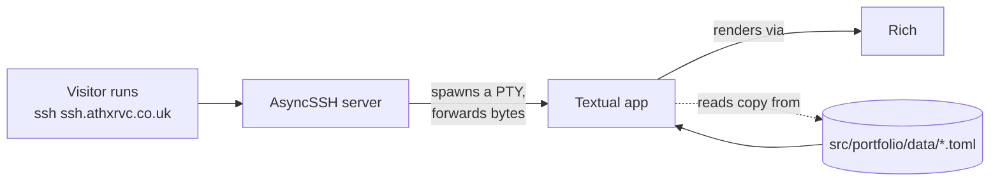

# portfolio-terminal

> An SSH-accessible terminal portfolio. Connect over SSH and you land inside
> an interactive Textual TUI — no browser, no account, no shell.

```bash
ssh ssh.athxrvc.co.uk
```

That's the entire pitch: drop a stranger into a tiny sandboxed terminal product
and walk them around.

---

## Why this exists

Most portfolios are websites, and I can't make good websites. This one is a
terminal product experience:

- **Connect** over SSH
- **See** ASCII branding, a portrait, and a bio
- **Navigate** sections with arrow keys
- **Never** get a real shell, command execution, or file transfer

It's hosted on a tiny VPS and replies to anyone.

---

## Features

- 🌐 **SSH-native.** Any client works — `ssh`, Termius, Blink, PuTTY.
- ⌨️ **Keyboard driven.** ← / → / ↑ / ↓ to move, Enter to open, Esc to back, `q` to quit.
- 🎨 **ASCII-first.** Custom portrait and name banner; sparkles twinkle around the banner.
- 🔒 **Sandboxed.** Anonymous auth, no shell channel, no SFTP, no exec. Every visitor gets a fresh isolated TUI in their own PTY.
- 📝 **Content as data.** All copy lives in TOML files under `src/portfolio/data/`. Adding a section is a new file plus one menu entry.
- 🪶 **Lightweight.** Single Python process, no database, no frontend build.

---

## Quick start

### Requirements

- Python **3.11+**
- [`uv`](https://docs.astral.sh/uv/) for deps and script entrypoints

### Run the TUI directly (fastest feedback loop)

Great for iterating on screens, content, or themes without an SSH server in
the way:

```bash
uv sync
uv run portfolio-tui
```

This runs the Textual app in your current terminal.

### Run the SSH server locally

```bash
uv sync
uv run portfolio-ssh
ssh -p 2222 127.0.0.1
```

The first run auto-generates an Ed25519 host key at `keys/ssh_host_key`
(ignored by git). Local mode binds to `127.0.0.1:2222` by default — override
with the `PORTFOLIO_HOST` / `PORTFOLIO_PORT` env vars (see
[Configuration](#configuration)).

---

## How it works

Each SSH connection maps to its own pseudo-terminal running the Textual TUI.
The server doesn't expose a shell — it only knows how to spawn the portfolio
process inside a PTY and pipe bytes back and forth.



Key design points:

- **Anonymous SSH.** `PortfolioSSHServer.begin_auth` returns `False`, so no
  credentials are required. Password and public-key auth are explicitly
  disabled.
- **PTY-per-session.** Every visitor gets an isolated pseudo-terminal running
  the TUI. `SIGWINCH` from terminal resizes is forwarded into the PTY so the
  layout reflows live.
- **No shell, no exec.** The server registers only a `process_factory` —
  no SFTP subsystem, no shell channel, no command execution. Visitors can
  only run the portfolio.
- **Raw bytes, no encoding.** Bytes pass between the SSH channel and the
  PTY unchanged (`encoding=None` on the AsyncSSH server), so Rich/Textual
  terminal escape sequences round-trip cleanly.
- **Content as data.** All copy lives in TOML under `src/portfolio/data/`.
  Adding a new section is a new file plus one menu entry — no code changes.

---

## Tech stack

| Layer | Tool | Why |
|-------|------|-----|
| Language | Python 3.11+ | Single runtime for server **and** UI |
| SSH server | [AsyncSSH](https://asyncssh.readthedocs.io/) | Async Pythonic SSH with PTY + `process_factory` |
| Terminal UI | [Textual](https://textual.textualize.io/) | Screen-based TUI, reactive state, stylesheets |
| Rendering | [Rich](https://rich.readthedocs.io/) | Styled text, OSC 8 hyperlinks, OSC 52 clipboard |
| Content format | TOML | Human-editable, diffable, living in version control |
| Tooling | [uv](https://docs.astral.sh/uv/) | Dependency management and console scripts |

---

## Project layout

```text
src/portfolio/
  __init__.py            package marker + version
  __main__.py            `python -m portfolio`  → starts the SSH server
  server.py              AsyncSSH server, host-key generation, PTY bridge
  app.py                 Textual App root; pushes HomeScreen on mount
  tui.py                 `portfolio-tui`  → runs the TUI in this terminal
  content.py             TOML loader, dataclasses, in-memory cache
  theme.py               Color constants (BG / FG / DIM / ACCENT / TITLE)
  theme.tcss             Textual stylesheet
  art/
    portrait.txt         ASCII portrait shown on the home screen
    name.txt             ASCII name banner (sparkles are drawn programmatically)
  screens/
    __init__.py
    home.py              Portrait + bio + section menu (sparkle animation)
    listing.py           Generic list screen; arrow-key nav, opens DetailScreen
    detail.py            Detail screen for a single item
    contacts.py          Selectable contacts; OSC 8 hyperlinks + OSC 52 clipboard fallback
  data/
    home.toml            Profile + home-screen menu (drives everything else)
    creations.toml       The Creations section
    reflections.toml     The Reflections section
    contacts.toml        Contact list
```

Most edits won't touch Python — see [Editing content](#editing-content).

---

## Editing content

All visible copy is data. You shouldn't need to touch code to:

- change your bio
- add or remove a section
- add or remove a contact
- swap the ASCII art

### `data/home.toml` — profile + menu

This file defines the bio and drives every other section via the `menu`.

```toml
[profile]
handle = "atharva"
intro  = ["Short tagline line 1", "Short tagline line 2"]
about  = ["About line 1", "About line 2", "About line 3"]
closing = ["", "Prompt to keep exploring"]
```

The home sparkles are drawn by `_glitter(name_art, frame)` in
`screens/home.py`; the actual letters come from `art/name.txt`.

The `menu` block controls the bottom row of the home screen:

```toml
[[menu]]
label = "Creations"
kind  = "listing"     # loads data/creations.toml as a list of items
key   = "creations"

[[menu]]
label = "Contacts"
kind  = "contacts"    # loads data/contacts.toml as a list of links
key   = "contacts"
```

To add a new section, drop a `data/<key>.toml` file and add an entry here —
**no code changes needed**.

### Section files — `data/<section>.toml`

Listing sections are broken into `groups`, each containing `items`:

```toml
title = "Creations"

[[groups]]
label = "projects"

  [[groups.items]]
  title = "Terminal Based Portfolio"
  url   = "ssh.athxrvc.co.uk"
  meta  = "2025"
  body  = [
    "The portfolio you're browsing right now,",
    "served over SSH.",
    "Built in Python with Textual for the UI",
    "and asyncSSH handling the server side.",
  ]
```

Each item has `title`, optional `meta` (small grey subline under the title),
optional `url` (rendered with a "View →" arrow on the detail screen), and a
list-only `body` of paragraphs. Group labels are optional; omit them by
setting `label = ""`.

### Contacts — `data/contacts.toml`

```toml
[[contacts]]
label = "LI"
value = "linkedin.com/in/atharva-c-1ba373277/"

[[contacts]]
label = "GH"
value = "github.com/athxrvc"

```

`url` is auto-derived from `value` by `content._normalize_url`:

- `github.com/athxrvc` → `https://github.com/athxrvc`
- `me@example.com` → `mailto:me@example.com`
- `https://...` / `mailto:...` pass through unchanged

On the contacts screen, Enter **tries the browser first**, then falls back to
**clipboard via OSC 52** (works through SSH). The status bar shows which one
worked.

### ASCII art

Drop two files into `src/portfolio/art/`:

- `name.txt` — wordmark shown on the home screen (anything up to ~24 cols wide)
- `portrait.txt` — left column on the home screen

Both are read verbatim and rendered through Rich, so monospace alignment in
your editor is what the user sees.

---

## Configuration

| Knob | Where | Default |
|------|-------|---------|
| Listen address | `PORTFOLIO_HOST` env var | `127.0.0.1` |
| Listen port | `PORTFOLIO_PORT` env var | `2222` |
| Host key path | `PORTFOLIO_HOST_KEY` env var | `keys/ssh_host_key` |
| Colours | `src/portfolio/theme.py` (`BG / FG / DIM / ACCENT / TITLE`) | muted dark + teal |
| Stylesheet | `src/portfolio/theme.tcss` | — |
| Wordmark / portrait | `src/portfolio/art/*.txt` | — |
| Sparkle effect | `src/portfolio/screens/home.py` (`SPARKLES`, `SPARKLE_STYLES`, `GLITTER_INTERVAL`) | — |

The console-script entrypoints are defined in `pyproject.toml`:

| Command | What it does |
|---------|--------------|
| `portfolio-ssh` (or `python -m portfolio`) | Start the AsyncSSH server |
| `portfolio-tui` | Launch the Textual app directly in the current terminal |

### Keyboard shortcuts

| Key | Where | Action |
|-----|-------|--------|
| ← / → | Home | Move between menu sections |
| ↑ / ↓ | Home | Move between menu sections |
| ↑ / ↓ | Listing / Contacts | Move between items |
| Enter | any | Open the highlighted thing |
| Esc | Listing / Detail / Contacts | Go back |
| `q` | any | Quit |

---

## Production deployment

The live instance at `ssh.athxrvc.co.uk` is a single Ubuntu VPS running
behind systemd. The official SSH public port serves the portfolio only; admin
access is on a separate non-default port.

```
Public  TCP/22     →  portfolio-ssh   (the TUI)
Private TCP/22222  →  OpenSSH         (admin/maintenance only)
```

Current infra details:

- **VPS:** FastHost (Ubuntu)
- **Domain:** `athxrvc.co.uk`
- **DNS:** `ssh.athxrvc.co.uk` → `77.68.125.29`
- **Auth:** Anonymous SSH for the portfolio; key-only OpenSSH on the admin port.

### systemd unit

Place at `/etc/systemd/system/portfolio-ssh.service` (adjust `WorkingDirectory`
and `User` to match your install location):

```ini
[Unit]
Description=portfolio-terminal SSH server (public, anonymous)
Documentation=https://github.com/athxrvc/portfolio-terminal
After=network-online.target
Wants=network-online.target

[Service]
Type=simple
User=portfolio
WorkingDirectory=/opt/portfolio-terminal
Environment=PORTFOLIO_HOST=0.0.0.0
Environment=PORTFOLIO_PORT=22
Environment=PYTHONUNBUFFERED=1
ExecStart=/opt/portfolio-terminal/.venv/bin/portfolio-ssh
Restart=on-failure
RestartSec=5
TimeoutStopSec=10

# Bind to a low port without running as root.
AmbientCapabilities=CAP_NET_BIND_SERVICE
NoNewPrivileges=true
ProtectSystem=strict
ProtectHome=true
ReadWritePaths=/opt/portfolio-terminal/keys

[Install]
WantedBy=multi-user.target
```

Then:

```bash
sudo systemctl daemon-reload
sudo systemctl enable --now portfolio-ssh
sudo systemctl status portfolio-ssh      # should show "active (running)"
ssh ssh.athxrvc.co.uk -p 22              # should land in the TUI
```

### Firewall

SSH is a binary protocol — don't put a TLS reverse proxy in front. Expose it
directly and let the host firewall / cloud security group split traffic:

```bash
# UFW example
sudo ufw allow 22/tcp                                     # public TUI
sudo ufw allow from <your admin IP> to any port 22222     # admin SSH only
sudo ufw enable
```

### Deployment checklist

1. Provision an Ubuntu VPS with a public IP.
2. Clone the repo to `/opt/portfolio-terminal`.
3. `uv sync` (creates `.venv`).
4. Generate or mount a persistent host key in `/opt/portfolio-terminal/keys/ssh_host_key`
   (the app will create one on first launch if absent — verify with
   `ls -la keys/` afterwards).
5. Open the firewall (see above).
6. Point `ssh.athxrvc.co.uk` DNS A-record at the VPS IP.
7. Enable the systemd unit.
8. `ssh ssh.athxrvc.co.uk` from your laptop and confirm the TUI renders.

---

## Troubleshooting

- **`OSError: [Errno 98] address already in use` on startup** — Port 22 (or
  what you set in `PORTFOLIO_PORT`) collides. Stop the conflicting service
  or change the env var.
- **`UNPROTECTED PRIVATE KEY FILE! ... keys/ssh_host_key`** — AsyncSSH
  refuses private keys that aren't `0600`. Run
  `chmod 600 keys/ssh_host_key`.
- **Visitor sees `This portfolio needs an interactive terminal ...`** —
  Their SSH client didn't request a PTY (e.g. ran
  `ssh ssh.athxrvc.co.uk cat /etc/hostname`). Plain
  `ssh ssh.athxrvc.co.uk` works.
- **Garbled layout remotely but fine locally** — Likely a `TERM` mismatch.
  Try `TERM=xterm-256color ssh ssh.athxrvc.co.uk`. Textual probes for
  modern terminal features on launch.
- **Resizing the SSH window doesn't reflow** — Most clients forward
  `SIGWINCH` automatically. PuTTY does; some embedded clients don't.
- **Host key changed after redeploy** — Persist `keys/` across deploys
  (it's gitignored for a reason: keep it out of the repo, but back it up
  off-host).
- **For screenshots / recordings** — Use `asciinema`, `script`, or just
  copy from a wide terminal. The portrait + name banner need roughly
  100×32 to look right.

---

## License

Personal portfolio; all rights reserved. Feel free to crib the
infrastructure (AsyncSSH + PTY bridge + Textual screens + TOML content
pipeline) for your own SSH-served portfolio.
